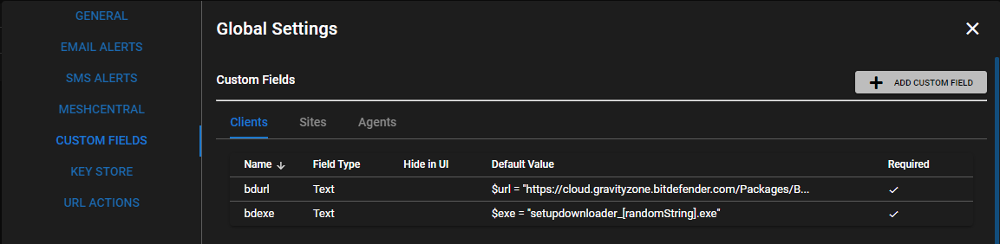

# BitDefender GravityZone Deployment

## How to Deploy BitDefender GravityZone

From the UI go to **Settings > Global Settings > CUSTOM FIELDS > Clients**

Add 2 Custom Field 

First:  
**Target** = `CLIENTS` 
**Name** = `bdurl` 
**Field Type** = `Text` 

Second:  
**Target** = `CLIENTS` 
**Name** = `bdexe` 
**Field Type** = `Text` 

Log into your GravityZone and on the left hand side, select "Packages" under "Network".

Select the client you are working with and click "Send Download Links" at the top.  

Copy the appropriate download link

Paste download link into the `bdur` when you right click your target clients name in the RMM.

Now copy the `setupdownloader_[randomstring].exe` into the `bdexe` field.

Right click the Agent you want to deploy to and **Run Script**. Select **BitDefender GravityZone Install** and set timeout for 1800 seconds.

**Install time will vary based on internet speed and other AV removal by BitDefender BEST deployment**
